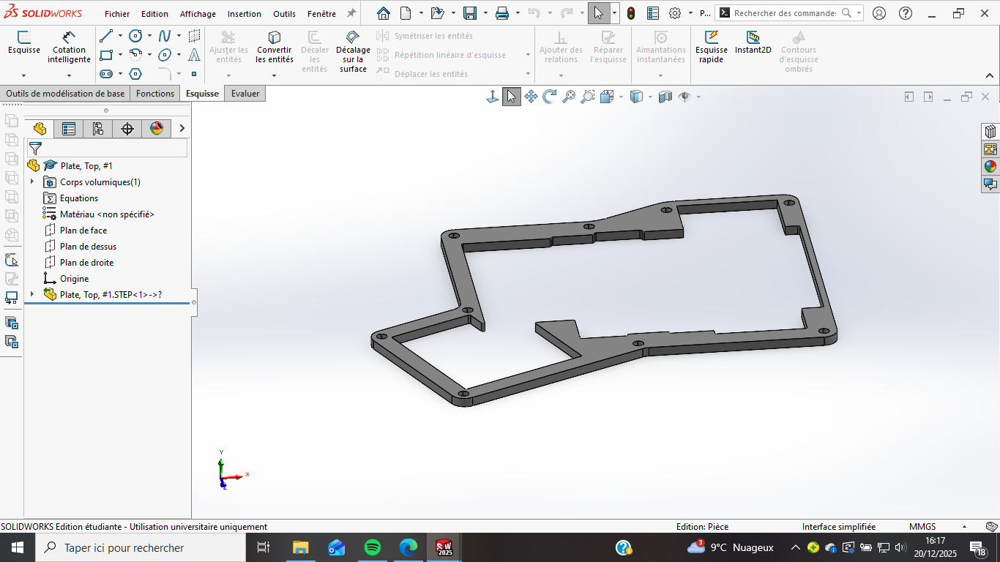
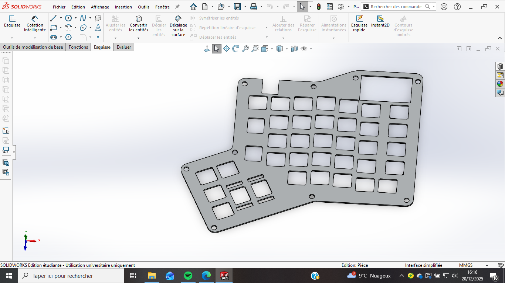

  <h1>⌨️ Projet Clavier Split Ergonomique</h1>
  
<i>Conception matérielle et mécanique par Quentin JALLAIS</i>

  Projet basé sur le modèle de BluePrint Hackclub : https://blueprint.hackclub.com/projects/2176?return_to=%2Fexplore%3Futm_source%3Dsite

  
  

## 🛠️ Conception du PCB
Le circuit imprimé a été conçu pour être séparé en deux parties. J'ai utilisé des pistes larges de **24mil** pour garantir une excellente fiabilité et faciliter la soudure des composants.

  

---

## 📐 Modélisation CAO (SolidWorks)
Le boîtier est optimisé pour l'impression 3D. Il se compose d'une plaque supérieure pour maintenir les interrupteurs et d'un cadre structurel.

<table width="100%">
  <tr>
    <td width="50%" align="center">
      
       
      <b>Plaque de maintien (Switch Plate)</b>
    </td>
    <td width="50%" align="center">
      
       
      <b>Cadre du boîtier (Case Frame)</b>
    </td>
  </tr>
</table>
---

<table>
  <tr>
    <td>
      <h2>🧠 Firmware & Programmation</h2>
      
Le clavier est piloté par le firmware <b>QMK</b>, ce qui permet une personnalisation totale :

      <ul>
        <li><b>Multi-couches :</b> Passage facile entre QWERTY( et oui je suis étrange je sais ), chiffres et symboles.</li>
        <li><b>Split :</b> Gestion native de la communication entre les deux moitiés.</li>
        <li><b>Macros :</b> Raccourcis complexes programmables sur une seule touche.</li>
      </ul>
      
<i>Le firmware peut être mis à jour simplement via USB avec QMK Toolbox.</i>

    </td>
    <td width="40%" align="center">
      
    </td>
  </tr>
</table>
---

## 🚀 État d'avancement
- [x] Routage du PCB (KiCad)
- [x] Modélisation des pièces (SolidWorks)
- [X] Impression 3D des composants (Bientôt)
- [X] Assemblage final et Firmware QMK/VIA

 

  <h3>📸 Rendu final !</h3>
  

  
<i>Je suis très content du rendu final. Si vous avez des questions n'hésitez pas a me les poser</i>

